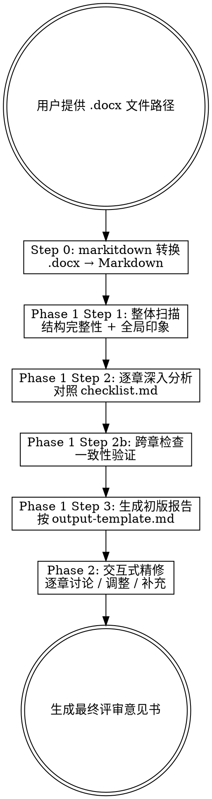

# 硕士学位论文评审

## 概述

系统化评审生命科学领域硕士学位论文。以导师视角提供建设性反馈，帮助学生在提交前改进论文质量。

**评审覆盖四大维度：**
1. 学术质量（研究问题、创新性、方法论、实验设计）
2. 写作质量（逻辑连贯性、论证严密性、语言表达）
3. 格式规范（章节完整性、图表规范、参考文献）
4. 数据与结果（数据呈现、统计分析、图表质量）

**严重程度标记：**
- 🔴 严重问题：必须修改，影响论文核心质量
- 🟡 需改进：建议修改，提升论文整体水平
- 🟢 良好：该方面表现良好，值得肯定

**输出语言：** 简体中文

## 工作流程



## Step 0：预处理

1. 用户提供论文 .docx 文件路径
2. 调用 `mcp__markitdown__convert_to_markdown` 将 .docx 转为 Markdown
3. 将转换结果保存到论文同目录下：`{filename}-converted.md`
4. 读取转换后的 Markdown，识别章节结构
5. 提取基本信息：论文题目、章节数、各章标题
6. 向用户报告：已完成转换，共识别到 N 个章节，列出章节标题

**如果用户未提供文件路径，提示：**
> 请提供硕士论文的 .docx 文件路径，例如：`/path/to/thesis.docx`

## Phase 1：自动深度分析

### Step 1 — 整体扫描

通读全文转换后的 Markdown，输出整体扫描报告：

1. **结构完整性**：检查是否包含所有必要章节（摘要、目录、绪论、材料与方法、结果、讨论、结论、参考文献、致谢）。列出缺失的章节。
2. **研究问题清晰度**：研究问题/科学问题是否在绪论中清晰提出？
3. **全局印象**：2-3 句话概括论文的整体质量和第一印象。
4. **初步发现**：标注最突出的问题或亮点（不超过 5 条）。

输出格式：
```
## 整体扫描报告

### 结构完整性
{分析}

### 研究问题清晰度
{分析}

### 全局印象
{2-3句概括}

### 初步发现
- 🔴/🟡/🟢 {发现1}
- 🔴/🟡/🟢 {发现2}
...
```

完成后告知用户："整体扫描完成，现在开始逐章深入分析。"

### Step 2 — 逐章深入分析

**在开始本步骤前，读取 `checklist.md` 获取完整的评审检查清单。**

按章节顺序，依次分析每一章：

对每章：
1. 读取该章内容
2. 对照 `checklist.md` 中该章节对应的检查项逐一评估
3. 对每个检查项给出严重程度标记和具体意见
4. 标注问题的具体位置（如能识别，给出段落位置描述）
5. 给出改进建议
6. 撰写本章综合评语（1 段）

每分析完一章，向用户输出该章的分析结果，格式：
```
### 第 N 章：{章节标题}

**本章概要**：{概括}

| 标记 | 问题/意见 | 具体位置 | 改进建议 |
|------|-----------|----------|----------|
| ... | ... | ... | ... |

**综合评语**：{评语}
```

**所有章节分析完成后，执行跨章检查：**

1. 绪论提出的所有研究问题 → 结果和讨论中是否都回应？列出未回应的问题。
2. 材料与方法中描述的所有实验 → 结果中是否都呈现了数据？列出缺失的数据。
3. 正文中的参考文献引用 ↔ 参考文献列表一致性检查。
4. 图表编号连续性检查。

输出跨章检查结果：
```
### 跨章一致性检查

| 检查项 | 状态 | 详情 |
|--------|------|------|
| 研究问题-结果对应 | 🟢/🔴 | {详情} |
| 方法-结果对应 | 🟢/🔴 | {详情} |
| 引用-文献一致性 | 🟢/🔴 | {详情} |
| 图表编号连续性 | 🟢/🔴 | {详情} |
```

### Step 3 — 生成初版评审报告

**读取 `output-template.md` 获取评审意见书模板。**

将 Step 1 和 Step 2 的所有分析结果，按模板格式汇总为完整的评审意见书。

关键要求：
- 所有占位符必须替换为实际内容
- "具体位置"列尽量精确
- 修改优先级建议（第四部分）从各章评审中提取所有 🔴 和 🟡 条目，去重合并
- 总结部分需给出修改的优先顺序建议

保存初版报告为 `{filename}-review-draft.md`（与论文同目录）。

输出提示：
> "初版评审报告已生成并保存至 `{path}`。"

随后自动进入 Phase 2。

## Phase 2：交互式精修

向用户展示操作菜单：

> **初版评审报告已完成，现在进入交互式精修阶段。你可以：**
>
> 1. **逐章讨论** — 告诉我要看哪一章，我展开详细讨论
> 2. **追问具体问题** — 例如「第三章的实验设计对照组设置是否合理？」
> 3. **调整意见** — 修改某条评审意见的严重程度或内容
> 4. **补充意见** — 添加你发现的我遗漏的问题
> 5. **完成精修** — 生成最终评审意见书
>
> 直接输入编号或描述你的需求：

**交互规则：**

- **逐章讨论**：重新读取该章内容，进行更深入的分析，与用户讨论具体问题。
- **追问具体问题**：定位到论文相关段落，给出针对性分析。
- **调整意见**：用户指定某条意见，修改其严重程度标记或文字内容。记录变更。
- **补充意见**：用户提出新的评审意见，确认后加入报告。
- **每次交互后**：显示该操作影响的报告部分的更新预览。
- **完成精修**：合并所有修改，按 `output-template.md` 格式生成最终版本。

## 最终输出

当用户选择"完成精修"：

1. 合并 Phase 1 初版报告与 Phase 2 所有修改
2. 按 `output-template.md` 模板生成最终评审意见书
3. 保存为 `{filename}-review-final.md`（与论文同目录）
4. 向用户确认：
   > "最终评审意见书已保存至 `{path}`。"
   >
   > 统计：🔴 {n} 条严重问题 / 🟡 {n} 条建议修改 / 🟢 {n} 条肯定

## 评审原则

在整个评审过程中，始终遵循以下原则：

1. **建设性为先**：指出问题的同时必须给出可操作的改进建议
2. **具体而非笼统**：避免"写作需加强"这类空泛评价，要指出具体哪里、为什么、怎么改
3. **肯定优点**：不要只挑问题，好的地方要明确标注 🟢
4. **区分严重程度**：🔴 仅用于真正影响论文核心质量的问题，不要滥用
5. **导师视角**：语气应兼具严谨和关怀，目标是帮助学生成长
6. **生命科学专业性**：关注实验设计的生物学合理性、数据的统计规范性、生物学命名规范等学科特有要求
